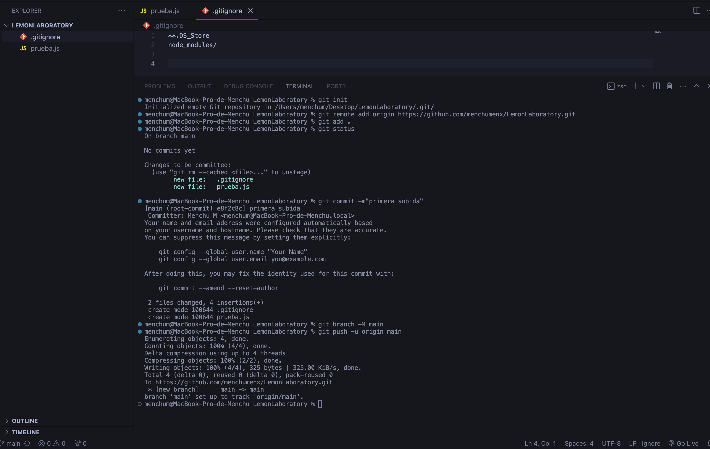

# LAVORATORIO GIT - PRÁCTICA 1

### CREANDO UN REPOSITORIO LOCAL
  - Creación de carpeta en el escritorio de la maquina para alojar el repositorio.
  - En la terminal, una vez posicionada en la carpeta, inicializo el repositorio local con el comando:
    ```terminal
    git init
    ```
### DE LOCAL A LA NUBE
  - Una vez inicializado el repositorio, creo el repositorio remoto, con el mismo nosmbre que el repositorio local
  - Ahora que tengo los dos repositorios, el siguiente paso es unirlos. Para ello utilizo el siguiente comando que me proporciona github
    ```terminal
    git remote add origin https://github.com/menchumenx/LemonLaboratory.git
    ```
  - Tras confirmar que estan enlazados, creo dos archivos para realizar mi primera subida. En este caso un archivo .js con un console.log(), y un archivo git ignore, para evitar que se suba el archivo .DS_Store.
  - Creados los archivos, los añado al stage y confirmo que no se añade .DS_Store
  - Confirmo los cambios con:
    ```terminal
    git commit -m"primera subida"
    ```
  - Ya tengo los cambios preparado para subir, pero al ser la primera subida necesito haer uso de los dos siguiente comando para terminar de configurar el enlace de los dos repositorios.
    ```termianl
    git branch -M main
    git push -u origin main
    ```
    ***git branch -M main*** renombra la rama actual a "main". La opción -M indica que se debe realizar un cambio forzado si la rama "main" ya existe.
    ***git push -u origin main*** empuja los cambios locales al repositorio remoto en la rama "main". La opción -u establece la rama "main" como la rama de seguimiento predeterminada.

    
    
    

    ### CREANDO UNA RAMA
    - Para crear una rama debemos estar posicionados sobre la rama principal, en mi caso **main**. Una vez ahí, haremos uso del comando ***git branch nombre_de_mi_rama*** para crearla.
    - Una vez creada he realizado cambios en mi archibo princial *pruebas.js*, creando un nuevo console.log(). Ademas he añadido una imagen a la carpeta assets.
    - Ahora que ya he realizado todos los cambios en mi rama, necesito subirla a remoto. Para ello seguire de nuevo los pasos anteriores:
    ```
    git add .
    git status
    git commit -m"creando mi primera rama"
    git push --set-upstream origin development
    ```
  - Ahora ya tengo mi rama en remoto, pero necesito que estas modificaciones esten en mi rama principal *main*. Por tando debo mergear mi rama con main. Antes de hacer el mergeo, es conveniente realizar un ***git pull*** sobre main, por si se hubieran subido cambios desde otras ramas.
  - Hecho el pull, haremos uso del comando ***git merge development** para mergerar nuestra rama development con main.
  - si es necesario resolveremos los confilctos. En mi caso no ha sido necesario.
  - Por último ya que hay nuevos cambios sobre la rama, volveremos a repetir nuestr *mantra*
    ```
    git add .
    git status
    git commit -m"creando mi primera rama"
    git push
    ```
  - Con esto habriamos actualizado nuestra rama principal *main* con la nueva rama creada *development*


    
